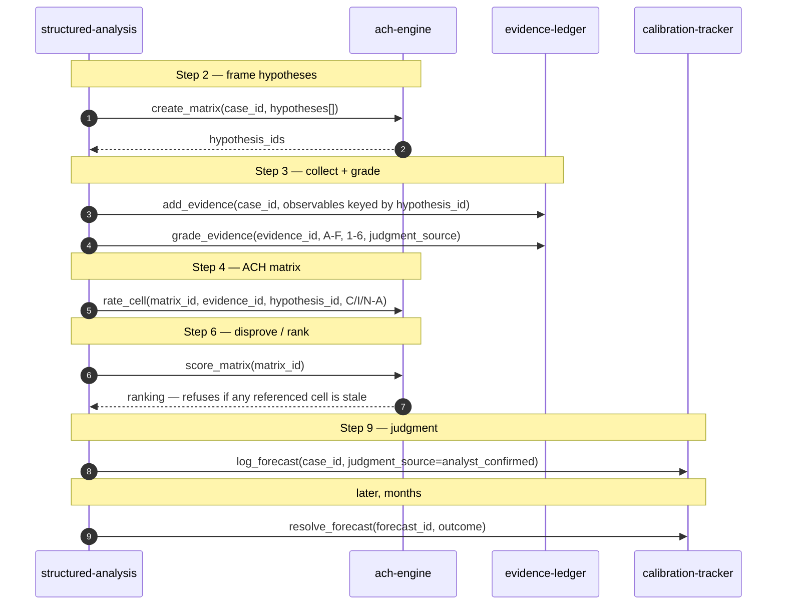

# Phase 3 — MCP state layer: detailed design + implementation plan (v3)

> The persistent state/compute layer for the intelligence-analysis agent. Realizes the blueprint's Layer 3
> (DESIGN-SPEC §36–55) at implementable detail. **v3** — iterated to must-fix=0 across all four advisors over three rounds — incorporates the gated 4-advisor review
> (mcp-protocol / mcp-security / mcp-quality / ai-agent-engineering). Built only after the prose core proved
> out (MVP-0 + Phase 2 passed their gates).

## Review response (what changed in v2)

All 10 converged must-fix items resolved at the design level (no code yet):

1. `resolve_forecast` gets an explicit `is_correction` + required `reason` (correction path now reachable).
2. `reliability_trend` + `CalibrationReport.note` pinned to transparent mechanical statistics (no synthesized verdict).
3. `cells.stale` removed from the insert-only row; staleness modeled as a separate append-only `stale_events` stream.
4. `pii` is now a required field (no fail-open default); `EvidenceRef` pinned to non-content fields only.
5. ach-engine gains an Errors section; `score_matrix` refusal enumerates the stale cells.
6. `hypothesis_id` origin defined (`create_matrix` mints stable synthetic IDs; `MatrixRef`/`Matrix.hypotheses` specified).
7. An explicit end-to-end call sequence (mapped to `structured-analysis` steps) is added.
8. Judgment **provenance** made explicit + honestly bounded: a `judgment_source` tag (ASSERTED by the skill, NOT server-verified — stated plainly, like `analyst_id`), gated at commit/scoring/aggregation; real enforcement is the calling skill's responsibility (v3 corrected a v2 overclaim here).
9. grade/update first-grade-vs-correction split enforced with named errors.
10. Protocol revision + FastMCP package pinned.

High-value should-fix folded in: `analyst_id` from a trusted local binding (not an LLM arg); `verify_chain` as a read-only tool run at startup + an external head-hash anchor; a `source_channel` provenance tag ahead of Phase-4 ingestion; parameterized queries; DB file topology + write-scoping; pagination on read-backs; named list wrapper models; `rationale` on judgment tools; `add_hypothesis`; `get_forecast`; `diagnosticity` declared narrative-only.

**Deferred (with reason), revisit at implementation:** batch `rate_cells` (latency-only; add if the per-cell loop proves painful in the wire test); `score_matrix` tie-break/N-A edge cases (pin in the fixture, not the contract); a sensitivity-analysis tool (deliberate scope cut — auto "what-if" ranking would risk the tool doing analytic work); MCP tool `annotations`/`title` (host-hint UX, add during impl).

## Scope + locked decisions

Three **FastMCP** servers, build order **calibration-tracker → evidence-ledger → ach-engine**:

| Server | Scope | Grounding |
|---|---|---|
| **calibration-tracker** | cross-case forecast log + Brier/calibration; lock question+probability at commit, only outcome appended | Tetlock C086; decisions #5 (forecast-lock), #4 (immutable) |
| **evidence-ledger** | per-case evidence + A–F/1–6 grade history, **+ a cross-case source-trust view** | FM 2-22.3 C428, Heuer ACH Step 2; Masterman C044 |
| **ach-engine** | per-case matrix; tool **scores + ranks by least-total-inconsistency**, ratings are inputs | Heuer C234, ACH Step 5; decision #6 |

- **Stack (pinned):** Python ≥3.11, **`fastmcp` (standalone jlowin/fastmcp) ≥ 2.3**, targeting **MCP protocol revision 2025-11-25** (min 2025-06-18 — required for structured output + input-validation-as-tool-error). **SQLite (WAL)** append-only + hash-chain. **pytest** deterministic fixtures. All DB access uses **bound parameters, never string interpolation** (the insert-only + hash-chain guarantees rest on this).
- **DB file topology:** three private per-server SQLite files + **one narrow shared `staleness.db`** that evidence-ledger may write (staleness signal only) and ach-engine reads — no server may write another's core tables.
- source-trust-registry is folded into evidence-ledger as a cross-case read (not a 4th server).

## Shared contract (all three servers)

**Grounded (traces to corpus / blueprint decisions):**

1. **The human analyst supplies the JUDGMENT value** (probability, grade, cell rating) as a **required input**; the tool only *validates against scale, computes, persists* — it never invents one *(decision #3)*.
2. **History is immutable** — corrections are **superseding entries**, never in-place edits *(#4)*.
3. **Forecasts lock at commit** — question+probability frozen; only outcome appended *(#5)*.
4. **ACH ranks by least-total-inconsistency** *(#6)*.
5. **Shared `case_id`** correlates state across servers *(#7)*.

**Judgment provenance (v2 — partial; honestly bounded).** Because a tool cannot distinguish a human-elicited value from an LLM-fabricated one passed through the same parameter, every judgment-input tool carries a required `judgment_source: Literal["analyst_confirmed","model_draft"]`. Only `analyst_confirmed` values may be committed to a *locking* op (`log_forecast`), trusted by a *scoring* op (`score_matrix`), or aggregated into a cross-case record (`get_source_history`); `model_draft` rows are working state, excluded from scoring/aggregation and flagged in the matrix. **Honest limit (exactly like `analyst_id`): `judgment_source` is ASSERTED by the calling skill, NOT verified by the server** — over stdio the tool cannot confirm a human read-back actually happened, so a compromised or careless skill (or one manipulated by `ingested` content) can assert `analyst_confirmed` without one. This tag therefore does **not** by itself *guarantee* decision #3; real enforcement is the calling skill/product's responsibility (present a read-back, get explicit human sign-off before passing `analyst_confirmed`). A token-gated `confirm_judgment` step (a short-lived token only a genuine out-of-band human action can mint, required by the judgment-input tools) is the candidate hardening for a later phase. The tag's value now is that it makes provenance **explicit + auditable** and lets scoring/aggregation exclude un-confirmed values — not that it proves a human saw them.

**Identity (v2).** `analyst_id` is **read from a trusted local binding** (env/config the server validates), NOT an LLM-fillable argument — a drifting/hallucinating agent cannot misattribute a record. Multi-analyst RBAC stays deferred (open decision #3); the field is present so enforcement can bind later without a schema change. `analyst_id` is *not* authenticated over stdio — stated, not pretended.

**Plumbing (engineering-inference, NOT corpus-grounded — flagged per the grounding rule):** FastMCP form; Pydantic shapes; `forecast_id`/`evidence_id`/`matrix_id`/`hypothesis_id`; timestamps; SQLite; the hash-chain; `is_error`; stdio; `source_channel`; staleness bookkeeping.

**Uniform conventions:**

- Read-back tools (`get_*`, `list_*`) required; **list tools return a named wrapper object** (`{items: [...], next_cursor?}`), never a bare array (MCP `structuredContent` must be an object), and take a `limit`+opaque `cursor`.
- Errors raised as `fastmcp.exceptions.ToolError`, structured + non-empty; a stale/precondition refusal **enumerates the offending IDs** so the model can act without a discovery round-trip.
- **No network egress** on any of the three.
- Every free-text field that later re-enters model context carries **`source_channel: Literal["analyst_typed","ingested"]`** (Phase-4 OSINT writes `ingested`) so consuming skills apply an untrusted-content fence — case content is inert data, never instruction.
- Append-only + hash-chain: each row carries `prev_hash`+`row_hash = sha256(prev_hash + canonical_json(payload))`, per (server, chain-key). **`verify_chain(scope)` is a read-only `@mcp.tool`** on every server, run at **server startup (fail loud, refuse to serve on mismatch)** and before any reviewer-facing aggregate read. Each chain's **head hash + the roster of known IDs is checkpointed to an external append-only manifest** (a git-committed file at this scale) so whole-chain deletion is externally detectable. `verify_chain` returns `ChainStatus{server, scope, ok, head_hash, rows_verified, mismatch?:{table, row_id, expected_hash, got_hash}}`. Startup verification calls the underlying Python function directly (pre-handshake, not over the wire — no `tools/call` exists before `initialize`); the `@mcp.tool` is the on-demand form a critic can invoke.
- Transport: **stdio**; all logging to **stderr only** (a stray stdout write corrupts the JSON-RPC channel).

## End-to-end call sequence (v2 — resolves must-fix #7)

Mapped to `structured-analysis` steps. **`create_matrix` is called early (Step 2)** so a stable `hypothesis_id` set exists before evidence is keyed to it — ach-engine is "built last" as *code*, but *invoked* right after hypotheses are framed:



A hypothesis discovered mid-analysis → `ach-engine.add_hypothesis(matrix_id, text)` (append-only column; prior cells intact).

---

## Server 1 — calibration-tracker (build FIRST)

### Tools

```python
mcp = FastMCP("calibration-tracker")

@mcp.tool
def log_forecast(case_id: str, question: str, probability: Annotated[float, Field(ge=0, le=1)],
                 resolution_criteria: str, horizon: str,
                 judgment_source: JudgmentSource, rationale: str = "") -> ForecastRef:
    """Log a NEW forecast and LOCK question+probability (#5). `probability` is the analyst's judgment
    (required). Requires judgment_source='analyst_confirmed' to commit (a model_draft is rejected here — a
    locked forecast must be human-confirmed). Idempotent on (case_id, question, analyst_id, round(probability,4))
    within a short window to survive retries; a different probability in-window creates a NEW row."""

@mcp.tool
def resolve_forecast(forecast_id: str, outcome: bool, resolved_at: str,
                     is_correction: bool = False, reason: str = "") -> ForecastRecord:
    """Append the OUTCOME to a locked forecast. First resolution: is_correction=False. To fix a wrong outcome:
    is_correction=True + non-empty reason (appends a superseding resolution; never edits). Errors if already
    resolved and is_correction is False; errors if is_correction and reason is empty."""

@mcp.tool
def void_forecast(forecast_id: str, reason: str) -> ForecastRecord:
    """Flag a MIS-LOGGED forecast (typo'd probability/question) as excluded from Brier scoring. **PRE-RESOLUTION
    ONLY: errors if a resolution row already exists** — a resolved forecast can never be voided, or a bad
    outcome could be purged retroactively under a 'typo' excuse (the retroactive-rationalization gaming
    forecast-lock exists to prevent). Append-only (the original row stays); pair with a fresh log_forecast.
    Reconciles #5 (lock) with #4 (always a remedy). Voids are counted in CalibrationReport.n_voided."""

@mcp.tool
def get_forecast(forecast_id: str) -> ForecastRecord: ...
@mcp.tool
def list_forecasts(case_id: str | None = None, resolved: bool | None = None,
                   limit: int = 100, cursor: str | None = None) -> ForecastList: ...
@mcp.tool
def get_calibration_report(case_id: str | None = None) -> CalibrationReport:
    """COMPUTE Brier + a calibration table (bucketed stated-p vs observed freq) + resolution/discrimination
    over analyst_confirmed, non-voided, resolved forecasts for the bound analyst_id. Read-only."""

@mcp.tool
def verify_chain(case_id: str | None = None) -> ChainStatus: ...
```

### Pydantic I/O

`JudgmentSource = Literal["analyst_confirmed","model_draft"]`. `ForecastRef{forecast_id, case_id, locked_at}`.
`ForecastRecord{forecast_id, case_id, question, probability, resolution_criteria, horizon, judgment_source,
rationale, locked_at, outcome?, resolved_at?, voided, row_hash}`. `ForecastList{items, next_cursor?}`.
`CalibrationReport{n, n_voided, brier, buckets:[{p_range, n, observed_freq}], resolution_component,
discrimination, note}` — `n_voided` makes retroactive exclusions visible in the report itself (not only by
diffing `list_forecasts`); `note` is templated deterministic caveats only (e.g. `"n<10"`), never open
commentary. (No model-draft count here — `log_forecast` rejects `model_draft` at write, so none can exist.)

### Data model (append-only)

`forecasts(forecast_id PK, case_id, question, probability, resolution_criteria, horizon, analyst_id,
judgment_source, rationale, locked_at, prev_hash, row_hash)`; `resolutions(forecast_id FK, outcome,
resolved_at, is_correction, reason, prev_hash, row_hash)`; `voids(forecast_id FK, reason, at, prev_hash, row_hash)`.

### Boundary / Errors

`probability` required input; Brier computed. Errors: unknown `forecast_id`; `probability∉[0,1]`; empty
`resolution_criteria`; `judgment_source!='analyst_confirmed'` on log; double-resolve without `is_correction`;
`is_correction` with empty `reason`; resolving a voided forecast; **voiding an already-resolved forecast**.

### Tests first

hand-computed Brier (matches `docs/validation/compute_brier.py`); forecast-lock (probability immutable);
correction appends not edits; void excluded from Brier; model_draft rejected on log.

---

## Server 2 — evidence-ledger (+ cross-case source-trust view)

### Tools

```python
@mcp.tool
def add_evidence(case_id: str, item: str, source_id: str, evidence_type: EvidenceType,
                 pii: bool, source_channel: SourceChannel,
                 expected_observables: dict[str, str] | None = None) -> EvidenceRef:
    """Store RAW evidence (no grade yet). `pii` REQUIRED (no default — analyst decides every time; source
    identity = life-safety). `expected_observables` maps hypothesis_id → 'should see / not see'. Returns a
    reference with NO content fields."""

@mcp.tool
def grade_evidence(evidence_id: str, reliability: Reliability, credibility: Credibility,
                   diagnosticity: str, judgment_source: JudgmentSource, rationale: str = "") -> EvidenceRecord:
    """Append the FIRST grade (accepts model_draft or analyst_confirmed — only analyst_confirmed enters the
    cross-case source-trust record): reliability A–F + credibility 1–6 (two INDEPENDENT required inputs).
    `diagnosticity` is a NARRATIVE annotation only — it does NOT feed score_matrix and is not reconciled
    against cell ratings. Errors if a grade already exists (use update_grade). Marks dependent ACH cells stale."""

@mcp.tool
def update_grade(evidence_id: str, reliability: Reliability, credibility: Credibility,
                 diagnosticity: str, reason: str, judgment_source: JudgmentSource,
                 rationale: str = "") -> EvidenceRecord:
    """Append a SUPERSEDING grade (required `reason`; never edits). Errors if no prior grade exists. Re-marks
    dependent ACH cells stale (records WHICH field changed)."""

@mcp.tool
def get_evidence(evidence_id: str, redact_pii: bool = True) -> EvidenceRecord: ...
@mcp.tool
def list_evidence(case_id: str, redact_pii: bool = True,
                  limit: int = 100, cursor: str | None = None) -> EvidenceList: ...
@mcp.tool
def get_source_history(source_id: str, redact_pii: bool = True) -> SourceHistory:
    """CROSS-CASE view (folded source-trust-registry, Masterman C044): the ordered sequence of this source's
    stored grades across cases + the direction of the most recent change. Aggregates ONLY `analyst_confirmed`
    grades (model_draft excluded — a never-confirmed grade must not enter a source's permanent trust record).
    A transparent RECORD of past analyst grades — NOT a synthesized trust score."""
@mcp.tool
def verify_chain(case_id: str | None = None) -> ChainStatus: ...
```

### Pydantic I/O

`Reliability = Literal["A","B","C","D","E","F"]`; `Credibility = Literal["1","2","3","4","5","6"]`;
`EvidenceType = Literal["report","assumption","deduction","absence"]`; `SourceChannel =
Literal["analyst_typed","ingested"]`. **`EvidenceRef{evidence_id, case_id, pii}`** (never `item`).
`EvidenceRecord{evidence_id, case_id, item|"REDACTED", source_id, evidence_type, source_channel,
expected_observables, grades:[{reliability, credibility, diagnosticity, judgment_source, rationale, reason?,
graded_at, superseded}], pii, row_hash}`. `SourceHistory{source_id, cases, grade_sequence:[A–F…],
last_change_direction, n, n_model_draft_excluded}` — a pure function of stored grades (fixture-tested);
`n_model_draft_excluded` shows how many un-confirmed grades were left out, so a thin record isn't mistaken for
a sparse one.

### Data model

`evidence(evidence_id PK, case_id, item, source_id, evidence_type, source_channel, expected_observables_json,
pii, prev_hash, row_hash)`; `grades(evidence_id FK, reliability, credibility, diagnosticity, analyst_id,
judgment_source, rationale, reason, graded_at, superseded, prev_hash, row_hash)`.

### Boundary / Errors / Security

grades are required inputs; source-history is a computed read. Errors: unknown `evidence_id`/`source_id`;
off-scale enum (FastMCP-enforced); `grade_evidence` on an already-graded item; `update_grade` with no prior
grade; grading a non-existent item. **PII:** `pii=True` rows return `"REDACTED"` unless `redact_pii=False` —
which is flagged so the host's confirmation policy gates it per-call, and the un-redact event is written to an
append-only, hash-chained `pii_access` log. `source_id` is an **opaque pseudonymous handle** (never itself
identity-bearing); cross-case `get_source_history` will need a need-to-know check once cases span sensitivity
compartments (deferred; noted).

### Tests first

enum/PII-default/supersession; `source_channel` round-trips; `get_source_history` pure-function fixture;
grade/update split errors; stale-event emitted with the changed field.

---

## Server 3 — ach-engine (build LAST)

### Tools

```python
@mcp.tool
def create_matrix(case_id: str, hypotheses: list[str]) -> MatrixRef:
    """Create the matrix; MINT a stable synthetic hypothesis_id per hypothesis text (IDs are independent of
    wording and stable across rewordings). Mutual-exclusivity is the ANALYST's responsibility — the tool only
    checks non-empty."""

@mcp.tool
def add_hypothesis(matrix_id: str, hypothesis: str) -> MatrixRef:
    """Append a new hypothesis column mid-analysis (append-only; prior cells intact)."""

@mcp.tool
def rate_cell(matrix_id: str, evidence_id: str, hypothesis_id: str, consistency: Consistency,
              strength: Strength, judgment_source: JudgmentSource, reason: str = "") -> CellRecord:
    """Append a consistency RATING for one (evidence × hypothesis) cell (required input). Supersede to change
    (non-empty `reason` on a correction). Errors on unknown matrix_id/evidence_id/hypothesis_id."""

@mcp.tool
def score_matrix(matrix_id: str) -> Ranking:
    """COMPUTE the ranking by LEAST-TOTAL-INCONSISTENCY (#6 — fewest STRONG inconsistencies leads; N/A excluded
    from the tally; ties broken by fewer weak inconsistencies then more diagnostic coverage — pinned in the
    fixture), flag non-diagnostic evidence (consistent with all). REFUSES if any referenced cell is stale or
    rests on a model_draft rating, and the ToolError ENUMERATES the offending (evidence_id, hypothesis_id)."""

@mcp.tool
def get_matrix(matrix_id: str) -> Matrix: ...
@mcp.tool
def list_matrices(case_id: str, limit: int = 100, cursor: str | None = None) -> MatrixList: ...
@mcp.tool
def verify_chain(case_id: str | None = None) -> ChainStatus: ...
```

### Pydantic I/O

`Consistency = Literal["C","I","N/A"]`; `Strength = Literal["strong","weak"]`.
`MatrixRef{matrix_id, case_id, hypotheses:[{hypothesis_id, text}]}`.
`Matrix{matrix_id, case_id, hypotheses:[{hypothesis_id, text}], cells:[{evidence_id, hypothesis_id,
consistency, strength, judgment_source, stale, stale_reason?, rated_at}]}`.
`CellRecord{matrix_id, evidence_id, hypothesis_id, consistency, strength, judgment_source, reason?, rated_at,
superseded, row_hash}`. `Ranking{ordered:[{hypothesis_id, strong_inconsistencies, weak_inconsistencies}],
non_diagnostic:[evidence_id], leading}` — the blocking cells travel on the `score_matrix` ToolError, not on
this success shape.

### Data model

`matrices(matrix_id PK, case_id, prev_hash, row_hash)`; `hypotheses(hypothesis_id PK, matrix_id FK, text,
added_at, prev_hash, row_hash)`; `cells(matrix_id FK, evidence_id, hypothesis_id, consistency, strength,
analyst_id, judgment_source, reason, rated_at, prev_hash, row_hash)` — **insert-only, NO stale column**.
Staleness lives in the shared `staleness.db`: `stale_events(evidence_id, changed_field, marked_at)`;
`score_matrix` computes a cell's staleness by join at read time (never mutates `cells`).
`stale_events(evidence_id, changed_field, marked_at, prev_hash, row_hash)` is itself chained + covered by
`verify_chain`, since it gates whether a ranking can be trusted.

### Boundary / Errors

cell ratings are required inputs; ranking is computed strictly by disconfirmation. Errors: unknown
matrix_id/evidence_id/hypothesis_id; empty hypothesis set; **missing `reason` when superseding an existing
cell rating** (mirrors `update_grade`/`resolve_forecast`); **stale/model_draft refusal that lists the exact
blocking cells**.

### Cross-server

`cells.evidence_id` → evidence-ledger; a grade change emits a `stale_events` row; `score_matrix` joins it and
refuses (listing blockers) until re-rated. Read freshness: `score_matrix` opens a fresh read of `staleness.db`
(WAL, no cached/pooled read) so a just-written flag is observed. **`get_matrix.stale` is best-effort and MAY
lag a just-written flag; `score_matrix` is the SOLE source of truth for scoring-readiness** (a read-back is not
a scoring gate).

### Tests first

hand-computed ACH ranking fixtures — the Iraqi-retaliation matrix from `docs/validation/case-workspace.md` as
a golden (H2 leads, 0 strong I); N/A-excluded + tie-break cases; non-diagnostic flag; stale-refusal enumerates
blockers; model_draft-refusal.

## Test plan (deterministic FIRST, per DESIGN-SPEC §73)

1. Per-server unit + deterministic fixtures (Brier, ACH ranking, enum, PII default, chain verify) — gate before any LLM use.
2. **Wire-level MCP smoke test per server:** `initialize`/`tools/list`; every input/output schema present + valid; one malformed-enum call and one business-rule violation, asserting which response shape (JSON-RPC error vs `result.isError`) each produces; assert stdout carries only clean JSON-RPC (logging on stderr).
3. Cross-server: grade-revision → `stale_events` → `score_matrix` refusal → re-rate → score.
4. Wire the skills; re-run the Heuer case MCP-backed.
5. **Real Brier gate:** log analyst_confirmed forecasts, append outcomes, `get_calibration_report` — the Brier now computed by the tool from logged data (the blind-ish gate Phase 2 couldn't do).

## Implementation sequencing

Per server, in build order: (a) Pydantic models + SQLite schema + hash-chain util (bound params only) +
external head-hash manifest; (b) deterministic tests + wire smoke test; (c) FastMCP tools; (d) register in the
product's MCP config for repo-local use, `verify_chain` at startup; (e) wire the consuming skill. Ship
calibration-tracker end-to-end (incl. the real Brier gate) before evidence-ledger; ach-engine last.
