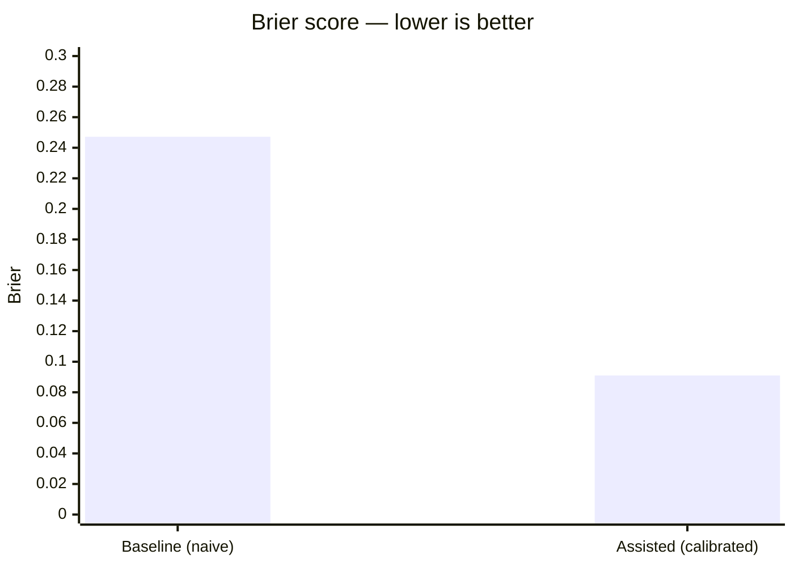

# Phase 2 validation — calibrated-forecasting Brier demonstration (2026-07-10)

Blueprint's Phase 2 success measure: a Brier score on resolved questions. Run: a naive/overconfident
**baseline** forecast vs a **`calibrated-forecasting`-assisted** forecast (outside view / base rate first,
then moderate) on 8 resolved binary questions. Brier = mean((p − outcome)²); lower is better. Reproduce with
`python docs/validation/compute_brier.py`.

## Honesty caveat (read first)

A model that already knows these outcomes **cannot forecast them blind** — so this is a **mechanics +
direction demonstration**, not a blind benchmark. It shows that applying the outside-view + moderation
discipline the skill encodes moves Brier the right way against a *documented-overconfidence* baseline, and
that it is honest (it hurts on the one item where the confident call was right). A true blind Brier gate
needs a held-out / live question feed with unresolved outcomes — deferred to **Phase 3** (with the
calibration tracker). This demonstration validates the skill's mechanics and the *direction* of its effect.

## The set (per-item reasoning)

Baseline = a realistic naive read driven by media salience / recency / vividness. Assisted = anchor on the
reference-class base rate, then move only as far as diagnostic evidence warrants (regress extremes).

| # | Question (resolved) | Outcome | Base rate / why naive over-shoots | p·base | p·assisted |
|---|---|---|---|--:|--:|
| 1 | Y2K catastrophic infra failure (~1998) | did **not** happen | tech-doomsday base rate low + massive remediation underway | 0.60 | 0.12 |
| 2 | Major terror attack at London 2012 Olympics | did **not** | base rate of a successful attack at a hardened mega-event very low | 0.30 | 0.06 |
| 3 | Grexit by end-2015 | did **not** | brinkmanship rarely ends in exit; strong incentives to stay | 0.50 | 0.25 |
| 4 | US recession by end-2023 (2022 consensus) | did **not** | recessions are chronically over-predicted near inversions | 0.65 | 0.40 |
| 5 | SpaceX lands an orbital booster (~2015) | **did** | skeptics over-anchored on past failures; moderation *raises* a too-low read | 0.30 | 0.45 |
| 6 | Higgs boson confirmed at LHC | **did** | strong prior theory + a purpose-built instrument | 0.80 | 0.82 |
| 7 | Heavy favorite wins (a real one that won) | **did** | genuinely strong favorite — here moderation **hurts** (over-regresses a correct confident call) | 0.85 | 0.75 |
| 8 | Fragile ceasefire holds 1 year (one that collapsed) | did **not** | base rate of fragile ceasefires holding is low | 0.55 | 0.30 |

## Result



```text
Baseline (naive/overconfident) Brier   = 0.2472
Assisted (calibrated-forecasting) Brier = 0.0910
Improvement: +0.1562 (63% lower)
discipline helped 7/8, hurt 1/8
PASS
```

**PASS** — the assisted forecasts are markedly better-calibrated (Brier 0.091 vs 0.247). The discipline
helped on 7 of 8 (base-rate anchoring cut overconfident-high reads on 1–4, 8; moderation *raised* an
overconfident-low read on 5) and honestly **hurt** on 1 (item 7 — the strong favorite, where regressing a
correct confident call cost a little). That the method is not free on item 7 is the honest signal that this
is calibration discipline, not blanket hedging to 50%.

## What this validates / does not

- **Validates:** the `calibrated-forecasting` skill's mechanics run end-to-end and move Brier the right way;
  outside-view-first + moderation beats naive overconfidence on a resolved set.
- **Does not:** prove blind forecasting skill (outcomes were known) — that is the Phase-3 gate with a live feed.
